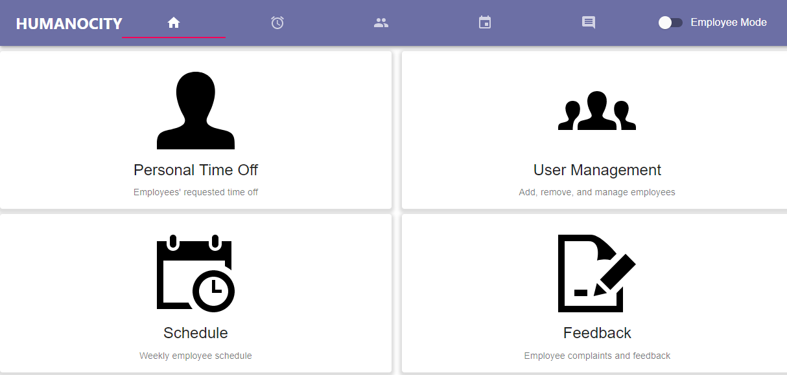
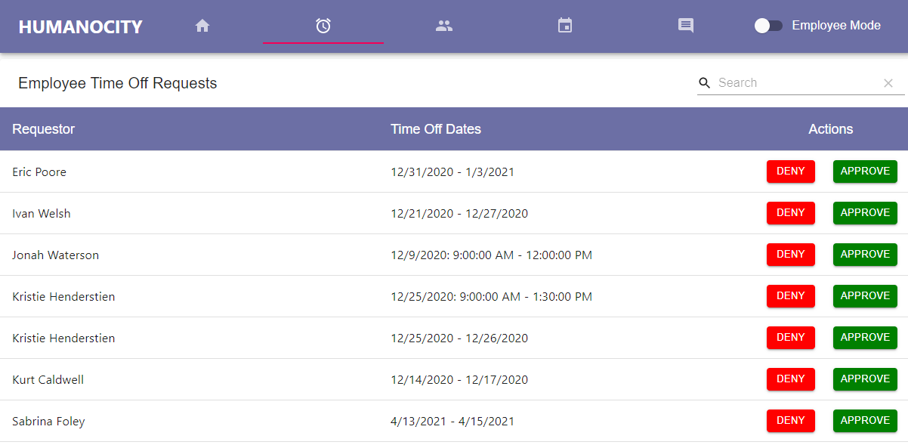
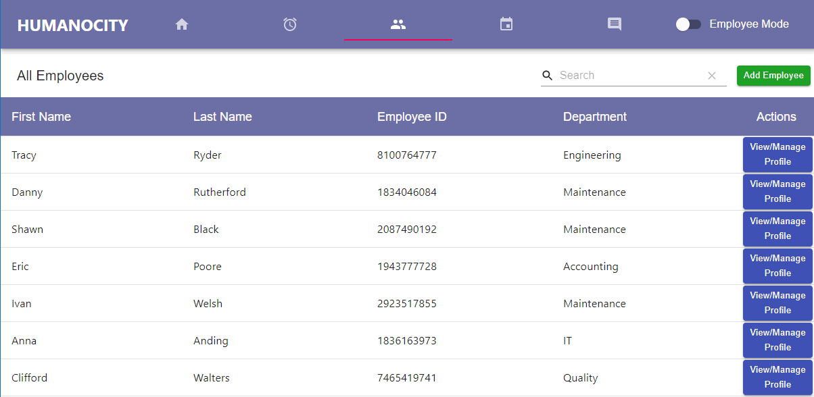
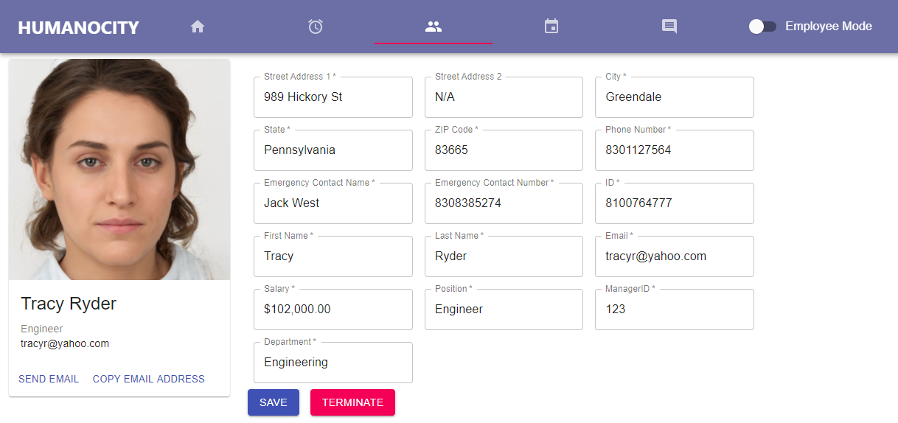
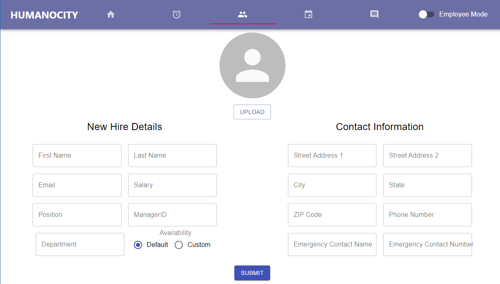
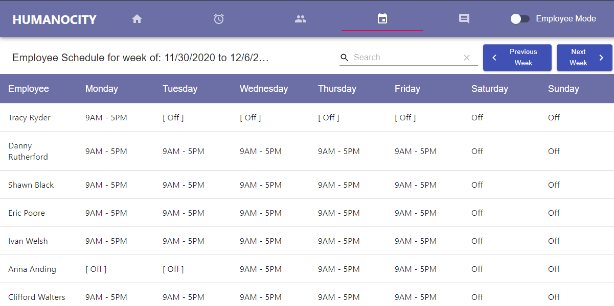
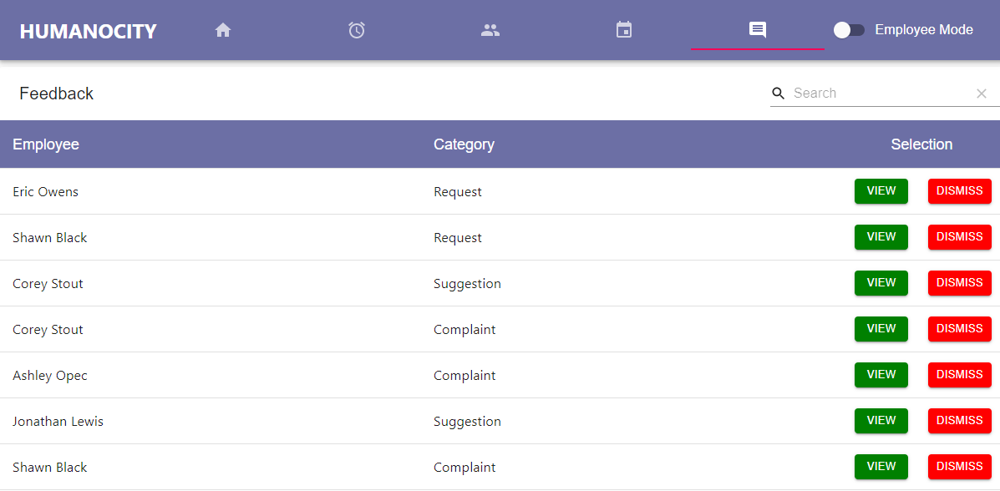
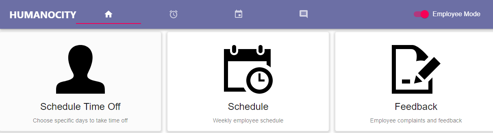
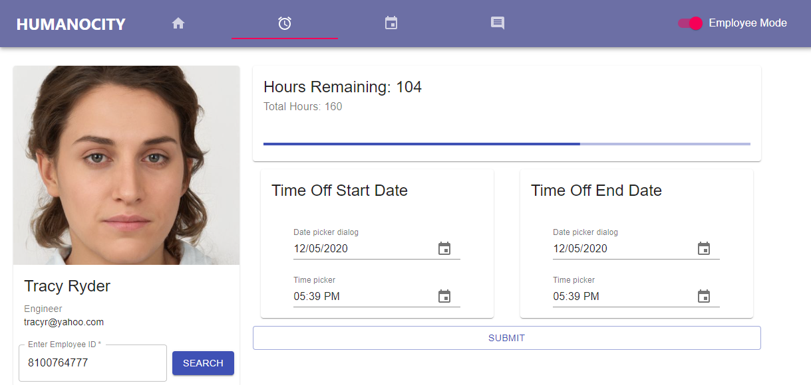
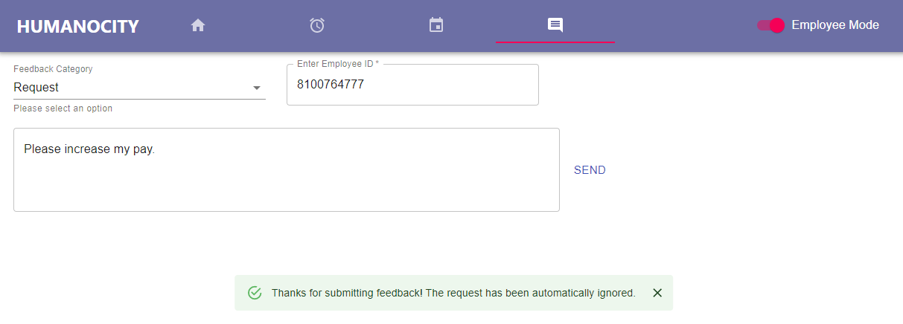

# Humanocity - A Human Resources Webapp

*Oakland University - CSI 2999 - Sophomore Project - Fall 2020*

 

## Application Goal
The goal was to have an application that could be used to successfully manage the employees of a company. The application serves as a database where HR managers can view employee information and edit it as needed. HR managers would want to use this application to keep a company and its employees organized in an accessible location.

## Team Members
* Dennes Donohue ([dennes4878](https://github.com/dennes4878))
* Alexander Jakubiak 
* Yonatan Mankovich ([yonimn2000](https://github.com/yonimn2000))
* Taylen Schmaltz ([SiriusVisuals](https://github.com/SiriusVisuals))
* Sterling Walker ([sterlingwalker](https://github.com/sterlingwalker))

## References
* Backend code for this project: [humanocity-server](https://github.com/sterlingwalker/humanocity-server)
* React Framework was used as the front-end framework: [reactjs.org](https://reactjs.org)
* MaterialUI components were used for the user interface of the application: [material-ui.com](https://material-ui.com)
* Material Table was used for the table components in the UI: [material-table.com](https://material-table.com)
* Spring was used as the backend framework: [spring.io](https://spring.io)
* AI generated photos of people: [generated.photos](https://generated.photos)
* Home page icons: [iconmonstr.com](https://iconmonstr.com/)

**Please note that all names, addresses, positions, salaries, photos, in this app are fictitious. Any similarity to actual persons, living or dead, is purely coincidental.**

## Screenshots

### HR View

#### Home Page

 

#### Time Off Requests Page

 

#### Employee Management Page

 

#### Employee Details Page

 

#### Add Employee Page

 

#### Schedule Page

 

#### Feedback Page

 

### Employee View

#### Home Page

 

#### Time Off Request Page

 

#### Feedback Submission Page

 